# Retail Sales Analysis using MySQL

## Project Overview

A MySQL-based Retail Sales Analysis project that uses SQL to analyze sales, products, customers, transactions, and regional performance.

## Objectives

- Analyze retail sales data using SQL
- Identify top-performing products and customers
- Analyze category-wise and region-wise sales
- Understand monthly sales trends
- Practice SQL joins and subqueries
- Use aggregation and filtering techniques
- Extract useful insights from retail sales data

## Technologies Used

- MySQL
- SQL
- phpMyAdmin

## Dataset

The project uses a retail sales dataset containing transaction, customer, product, sales, payment, channel, and region information.

### Main Columns

- Transaction ID
- Transaction Date
- Customer ID
- Product ID
- Product Name
- Category
- Quantity
- Unit Price
- Discount Rate
- Sales Amount
- Payment Method
- Sales Channel
- Region

## SQL Concepts Used

- SELECT
- DISTINCT
- GROUP BY
- ORDER BY
- LIMIT
- Aggregate Functions
- SUM()
- COUNT()
- AVG()
- ROUND()
- YEAR()
- MONTH()
- HAVING
- Subqueries
- INNER JOIN
- LEFT JOIN

## 🔍 SQL Analysis

### 1. VERIFY DATA

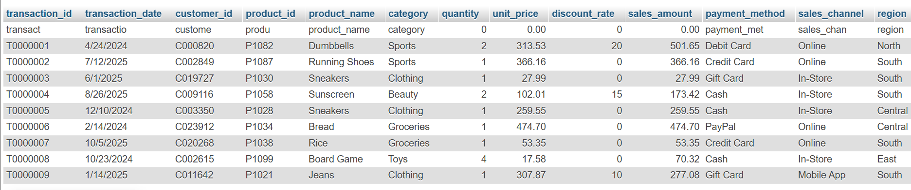

### 2. TOTAL RECORDS

### 3. TOTAL SALES PER PRODUCT

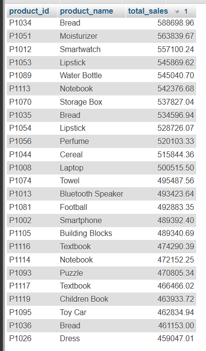

### 4. TOTAL SALES PER CATEGORY

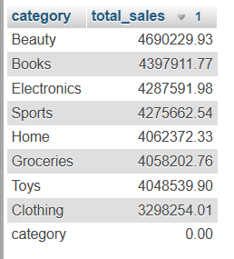

### 5. TOP 5 CUSTOMERS BY TOTAL PURCHASE

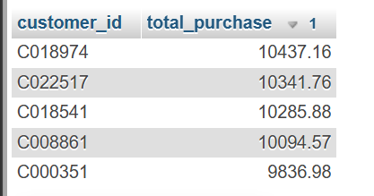

### 6. MONTHLY SALES TREND

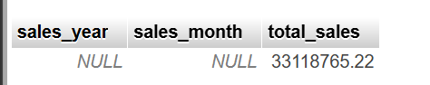

### 7. AVERAGE TRANSACTION VALUE USING SUBQUERY

### 8. HAVING CLAUSE

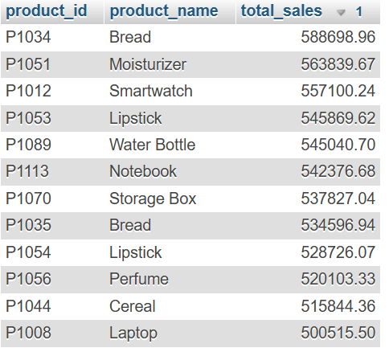

### 9. CREATE CUSTOMER TABLE FOR JOIN

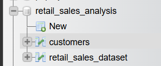

### 10. INNER JOIN

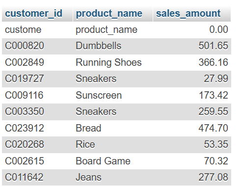

### 11. CUSTOMER-WISE TOTAL SALES

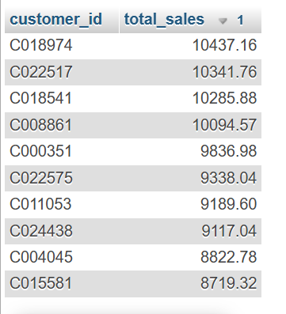

### 12. LEFT JOIN

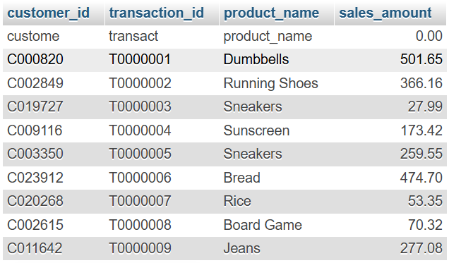

### 13. CUSTOMERS WITHOUT TRANSACTIONS

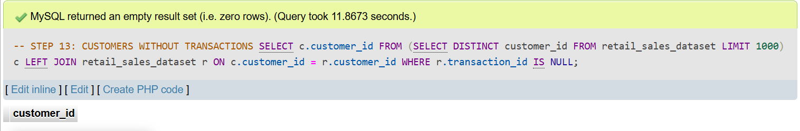

### 14. TOTAL NUMBER OF TRANSACTIONS PER CUSTOMER

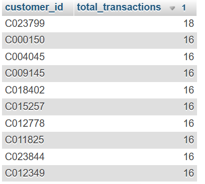

### 15. REGION-WISE SALES

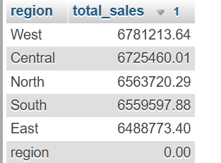

### 16. OVERALL SALES SUMMARY

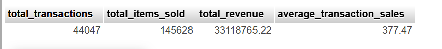

## Key Learning

This project provided practical experience in SQL-based retail sales analysis, including:

- Data aggregation
- Grouping and sorting
- Subqueries
- HAVING clause
- INNER JOIN
- LEFT JOIN
- Customer analysis
- Product analysis
- Monthly sales analysis
- Regional sales analysis
- Transaction analysis

## Conclusion

This project demonstrates how SQL can be used to analyze retail sales data and extract meaningful insights related to products, customers, transactions, and regional performance.
